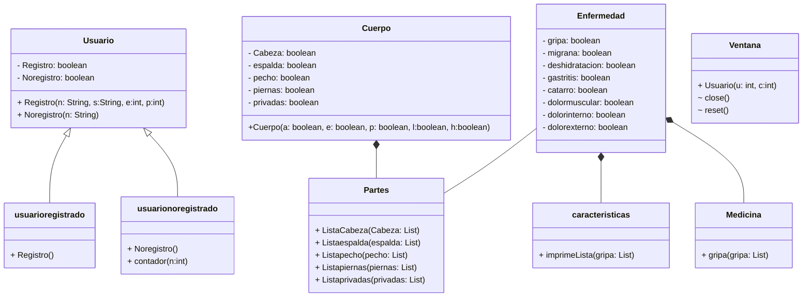

# Diagrama de clases Primer Ejercicio

```mermaid
classDiagram
    Usuario <|-- usuarioregistrado 
    Usuario <|-- usuarionoregistrado
    Enfermedad -- Partes
    Cuerpo *-- Partes
    Enfermedad *-- caracteristicas
    Enfermedad *-- Medicina
    class Cuerpo{
        - Cabeza: boolean
        - espalda: boolean
        - pecho: boolean
        - piernas: boolean
        - privadas: boolean
        +Cuerpo(a: boolean, e: boolean, p: boolean, l:boolean, h:boolean)
    }
    class Ventana{
        + Usuario(u: int, c:int)
        ~ close()
        ~ reset()
    }
    class Partes{
        + ListaCabeza(Cabeza: List)
        + Listaespalda(espalda: List)
        + Listapecho(pecho: List)
        + Listapiernas(piernas: List)
        + Listaprivadas(privadas: List)
    }
    class Enfermedad{
        - gripa: boolean
        - migrana: boolean
        - deshidratacion: boolean
        - gastritis: boolean
        - catarro: boolean
        - dolormuscular: boolean
        - dolorinterno: boolean
        - dolorexterno: boolean
    }
    class Medicina{
        + gripa(gripa: List)
    }
    class caracteristicas{
        + imprimeLista(gripa: List)
    }
    class Usuario{
        - Registro: boolean
        - Noregistro: boolean
        + Registro(n: String, s:String, e:int, p:int)
        + Noregistro(n: String)
    }
    class usuarionoregistrado{
        + Noregistro()
        + contador(n:int)
    }
    class usuarioregistrado{
        + Registro()
    }
    
```
