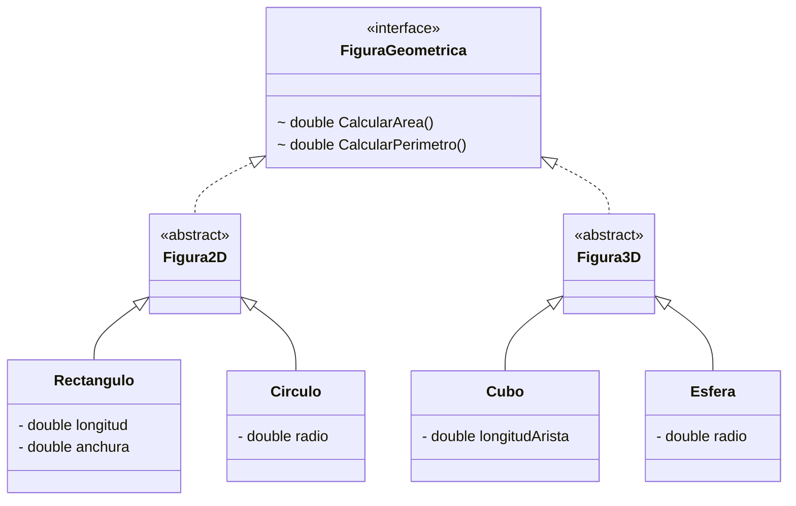

# Diagrama de Clases 2

```mermaid
classDiagram
    FiguraGeometrica <|.. Figura2D
    FiguraGeometrica <|.. Figura3D
    Figura2D <|-- Rectangulo
    Figura2D <|-- Circulo
    Figura3D <|-- Cubo
    Figura3D <|-- Esfera
    class FiguraGeometrica{
        <<interface>>
        ~ double CalcularArea()
        ~ double CalcularPerimetro()
    }
    class Figura2D{
        <<abstract>>
    }
    class Figura3D{
        <<abstract>>
    }
    class Rectangulo{
        - double longitud
        - double anchura
    }
    class Circulo{
        - double radio
    }
    class Cubo{
        - double longitudArista
    }
    class Esfera{
        - double radio
    }
```