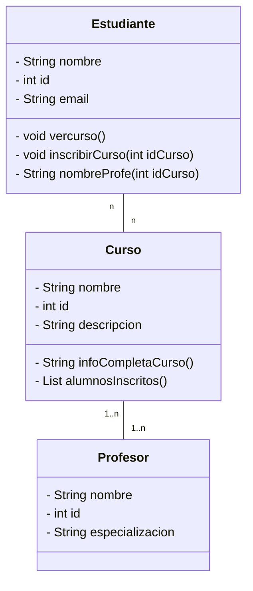

# Tercer Diagrama de Clases

```mermaid
classDiagram
    Estudiante "n" -- "n" Curso
    Curso "1..n" -- "1..n" Profesor
    class Estudiante{
        - String nombre
        - int id
        - String email
        - void vercurso()
        - void inscribirCurso(int idCurso)
        - String nombreProfe(int idCurso)
    }
    class Curso{
        - String nombre
        - int id
        - String descripcion
        - String infoCompletaCurso()
        - List alumnosInscritos()
    }
    class Profesor{
        - String nombre
        - int id
        - String especializacion
    }


```