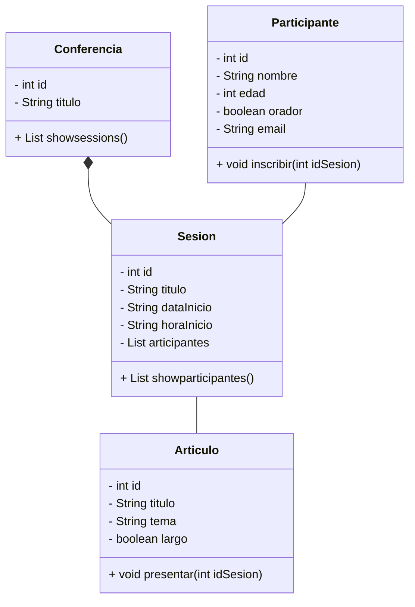

### Diagrama

```mermaid
classDiagram
    Conferencia *-- Sesion
    Sesion -- Articulo
    Participante -- Sesion
    class Conferencia{
        - int id
        - String titulo
        + List showsessions()
    }
    class Sesion{
        - int id
        - String titulo
        - String dataInicio
        - String horaInicio
        - List articipantes
        + List showparticipantes()
    }
    class Participante{
        - int id
        - String nombre
        - int edad
        - boolean orador
        - String email
        + void inscribir(int idSesion)
    }
    
    class Articulo{
        - int id
        - String titulo
        - String tema
        - boolean largo
        + void presentar(int idSesion)
    }

```
